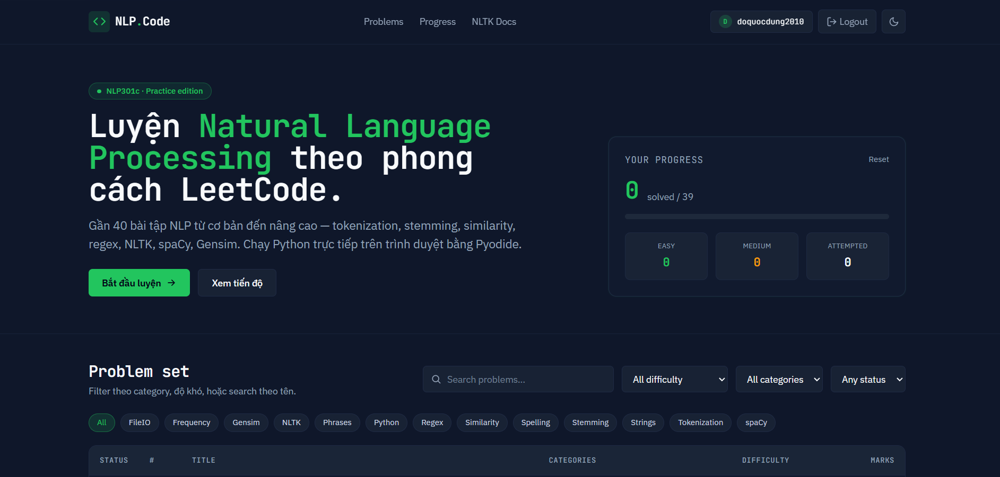
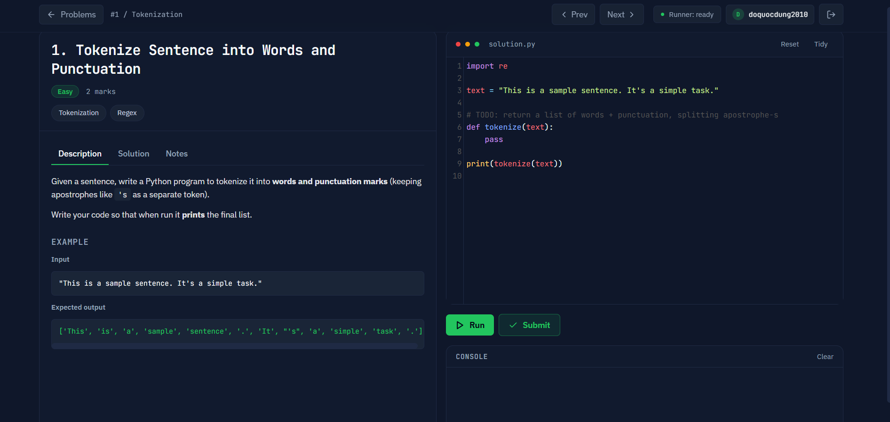

# NLP LeetCode

LeetCode-style practice site cho môn NLP301c. 39 bài tập, chạy Python thật trên server, có auth và sync tiến độ.

## Giao diện

### Dashboard



### Problem Example



## Kiến trúc

```
nlp-leetcode/
├── docker-compose.yml          # 2 services: web + api
├── .env.example                # SECRET_KEY, resource limits
├── frontend/                   # HTML + Tailwind + CodeMirror, phục vụ bằng nginx
│   ├── Dockerfile
│   ├── nginx.conf              # proxy /api/ -> api:8000
│   ├── index.html              # problem list
│   ├── problem.html            # editor + runner
│   ├── login.html + register.html
│   ├── css/style.css
│   └── js/
│       ├── api.js              # API client + auth state
│       ├── auth-page.js        # login/register form logic
│       ├── app.js              # list page
│       ├── problem-page.js     # problem page
│       └── problems.js         # 39 problem definitions
└── backend/                    # FastAPI + SQLAlchemy + SQLite
    ├── Dockerfile              # preinstall nltk+spacy+gensim + models
    ├── requirements.txt
    ├── download_nltk.py        # pre-downloads corpora at build time
    └── app/
        ├── main.py             # routes
        ├── auth.py             # JWT + bcrypt
        ├── config.py           # env settings
        ├── db.py / models.py / schemas.py
        └── runner.py           # sandboxed subprocess code executor
```

## Chạy

Cần Docker Desktop (hoặc Docker Engine + compose plugin).

```bash
cd nlp-leetcode
cp .env.example .env
# sửa SECRET_KEY trong .env

docker compose up --build
```

Lần đầu build mất 5–10 phút (tải + cài nltk, spacy, gensim + model `en_core_web_sm`, `en_core_web_md`, nltk book corpus). Image backend khoảng ~1.5 GB.

Khi thấy log `Uvicorn running on http://0.0.0.0:8000`:

- Web: <http://localhost:8080>
- API docs (Swagger): <http://localhost:8000/docs>
- Health: <http://localhost:8000/api/health>

Lần đầu vào web sẽ redirect sang `/register.html` — tạo tài khoản rồi bắt đầu luyện.

Dừng: `docker compose down`. Xoá cả database (SQLite trong named volume): `docker compose down -v`.

## Endpoints

| Method | Path | Mô tả |
|---|---|---|
| POST | `/api/auth/register` | `{email, username, password}` → `{access_token, user}` |
| POST | `/api/auth/login` | `{email, password}` → `{access_token, user}` |
| GET  | `/api/me` | Current user (cần Bearer token) |
| GET  | `/api/progress` | Liệt kê progress của user |
| POST | `/api/progress` | Upsert progress `{problem_id, status, code?}` |
| DELETE | `/api/progress` | Xoá toàn bộ progress của user |
| POST | `/api/run` | Chạy Python `{code, problem_id?}` → `{stdout, stderr, status, duration_ms}` |

Tất cả endpoint (trừ `register`, `login`, `health`) cần header `Authorization: Bearer <token>`.

## Sandbox code runner

`backend/app/runner.py` chạy code user qua `subprocess.run` với:

- Wallclock timeout 10s (chỉnh bằng `EXEC_TIMEOUT_S`)
- `RLIMIT_AS` memory cap 512MB (`EXEC_MEM_MB`)
- `RLIMIT_CPU`, `RLIMIT_NPROC`, `RLIMIT_CORE = 0`
- Chạy dưới user `sandbox` (uid 10001), drop root sau fork
- Isolated `tempfile.TemporaryDirectory()` làm `cwd` + `HOME` + `TMPDIR`
- Scrubbed env (chỉ còn `PATH`, `LANG`, `NLTK_DATA`, ...)

Đây KHÔNG phải full sandbox. Không expose API public lên internet khi chưa thêm lớp isolation phù hợp (nsjail, firejail, gVisor, per-request container).

## Phát triển local (không dùng Docker)

Backend:

```bash
cd backend
python -m venv .venv && source .venv/bin/activate   # Windows: .venv\Scripts\activate
pip install -r requirements.txt
python -m spacy download en_core_web_sm
python -m spacy download en_core_web_md
python download_nltk.py    # sẽ tải vào /usr/share/nltk_data, có thể cần sudo — sửa đường dẫn nếu không phải Linux
uvicorn app.main:app --reload --port 8000
```

Frontend:

```bash
cd frontend
# Dùng bất kỳ static server nào
python -m http.server 8080
```

Lưu ý: nếu frontend ở `http://localhost:8080` và backend ở `:8000` không qua nginx proxy, chỉnh `API_BASE` trong `js/api.js` thành `"http://localhost:8000"` và đảm bảo `cors_origins` trong backend cho phép origin đó (đã có sẵn `http://localhost:8080`).

## Stack

- **Frontend**: HTML + Tailwind (CDN) + CodeMirror 5 + vanilla JS
- **Backend**: FastAPI + SQLAlchemy 2 + Pydantic v2 + passlib/bcrypt + python-jose (JWT HS256)
- **DB**: SQLite (file trong named volume `api-data`). Đổi `DATABASE_URL` qua env là chuyển sang Postgres được.
- **Reverse proxy**: nginx alpine
- **Code runner**: python subprocess + resource rlimits + su tới non-root uid
